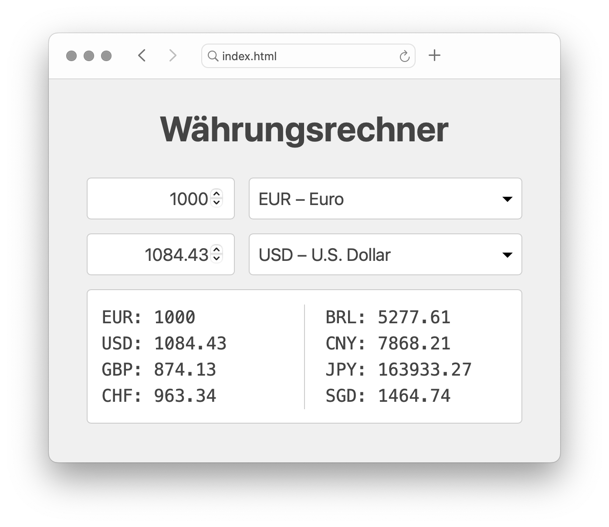

# Währungsrechner

## Aufgabe

1. Die Anwendung lädt beim Start die aktuellen Wechselkurse von https://www.floatrates.com/json-feeds.html herunter ("Euro (EUR) JSON Feed")
1. Die Dropdowns werden automatisch mit allen geladenen Währungen gefüllt
1. Es wird ein sinnvoller initialer Zustand angezeigt
1. Änderungen in einem Input-Feld aktualsieren das jeweils andere Input-Feld
1. Alle Änderungen aktualisieren die Liste der zehn Favouriten-Währungen
